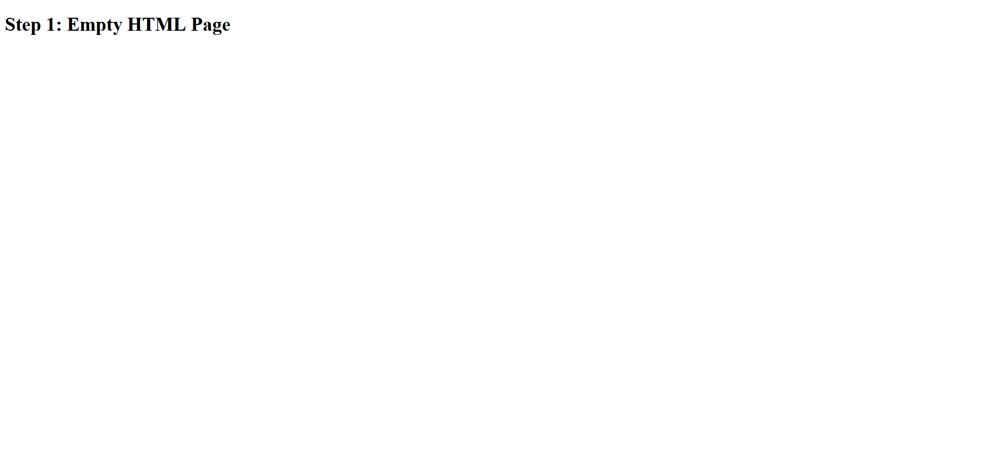
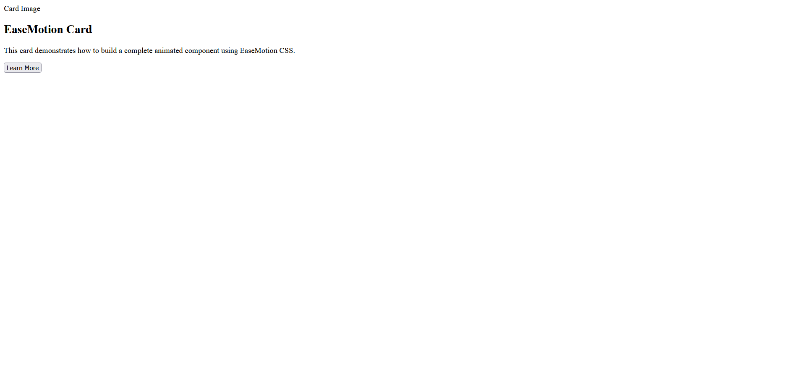
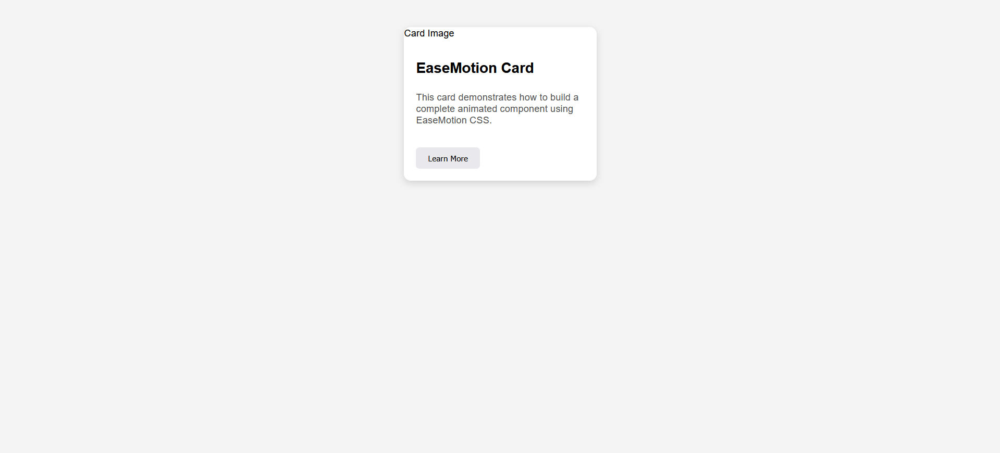

# Building Your First Component with EaseMotion CSS

This tutorial shows how to build a complete animated card component step-by-step using EaseMotion CSS.

---

## Step 1: Start with Empty HTML

Create a basic HTML page.

Screenshot:



---

## Step 2: Add Card Structure

Add:

* Card container
* Image
* Title
* Description
* Button

Example:

```html
<div class="card">
    

    <h2>EaseMotion Card</h2>

    <p>
        This is a simple card component built using EaseMotion CSS.
    </p>

    <button>Learn More</button>
</div>
```

Screenshot:


---

## Step 3: Add Styling

Apply styles to make the card look modern and polished.

Screenshot:



---

## Step 4: Add EaseMotion Animation

Add an EaseMotion animation class:

```html
<div class="card ease-fade-in">
```

Screenshot:



---

## Final Result

You now have a complete animated card component.

### Benefits

* Easy to build
* Easy to customize
* Human-readable animation classes
* Reusable component design
* Better developer experience

### EaseMotion Advantage

Instead of writing custom animation keyframes, developers can simply apply descriptive classes such as:

```html
<div class="ease-fade-in"></div>
<div class="ease-bounce"></div>
<div class="ease-slide-up"></div>
```

This improves readability and reduces development time.
